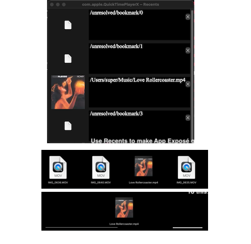

# Recents

Re-arrange or delete Recent Items. Does not work on apps that don't show recent items @ bottom of App Exposé (later on I may add custom views for: Notes (via applescript)/Safari (History)/iTerm2 (recent paths via zoxide), and potentially a Jetbrains plugin)

**Permissions:** requires "Full Disk Access" to access recents file(s)

### protip: @ end of Settings -> Control Center, you can increase up to 50 recent items

# note: you should make your changes WITH the target application QUIT

