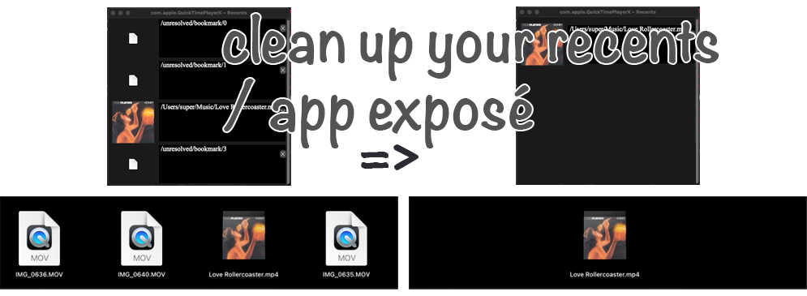

# Recents

Re-arrange or delete Recent Items. Does not work on apps that don't show recent items @ bottom of App Exposé (later on I may add custom views for: Notes (via applescript)/Safari (History)/iTerm2 (recent paths via zoxide), and potentially a Jetbrains plugin)

**Permissions:** requires "Full Disk Access" to access recents file(s)

### Protip: @End of System Settings -> Control Center:&nbsp; you can choose to display up to 50 recent items.

# note: in most cases you need to quit the (target) application in order for changes to persist
